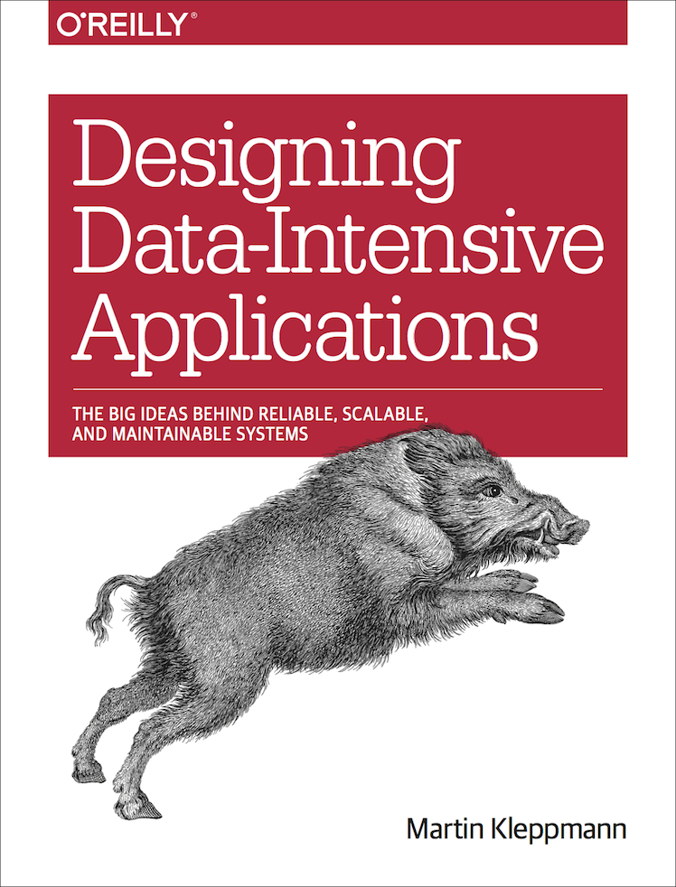

My notes on the quintessential distributed systems book
[Designing Data-Intensive Applications](https://www.oreilly.com/library/view/designing-data-intensive-applications/9781491903063/) 
by Dr. Martin Kleppmann.



# Table of Contents

# Part I: Foundations of Data Systems

## Reliable, Scalable and Maintainable Applications

TBC.

## Data Models and Query Languages

Most software applications are built by layering one data model over another. For
each layer, the key question is: how is it _represented_ in terms of the next layer?
For example:

1. Application developers model the real world into data structures, 
and APIs (algorithms) that manipulate those data structures.
2. When you want to store these data structures, you convert them into general-purpose
data models such as JSON, XML, SQL tables, graph models etc.
3. The database developers decided on a way to convert these data models in terms of
bytes in memory, on disk, or on a network. They also decided on a way to do operations 
(like CRUD) on this data.
4. At the lowest level, hardware engineers represent those bytes in terms of 
electrical currents, magnetic fields, light pulses etc.

### Relational model vs document model

Relational model: data is organized into relations (called tables in SQL), 
where each relation is an unordered collection of tuples (rows in SQL).

Originally used for business data processing in the 60s and 70s:
- Transaction processing: sales transactions, airline reservations.
- Batch processing: customer invoicing, payroll, reporting.

The goal of the relational model was to abstract away the internal representation
of the data behind a cleaner interface.

#### The Birth of NoSQL

NoSQL started in the 2010s to overcome some limitations of the relational model:
- Scalability, including very large datasets or very high write throughput
- FOSS over commercial software
- Specialised query operations that are not supported by SQL
- Desire for a more dynamic and expressive schema or data model

#### The Object-Relational Mismatch

Modern applications have an _impedance mismatch_ between the object-oriented 
application code and the relational data in databases. ORMs can help reduce the
differences but not completely eliminate them.

For data structures like self-contained documents (e.g. resumes), a JSON 
representation is more suitable than a relational model due to better locality
and the one-to-many relationships (i.e. a tree structure) is explicit in JSON.

#### Many-to-One and Many-to-Many Relationships

Using an ID vs a string to store data is a question of duplication. When using
IDs, the data is only stored in one place, and everything refers to the ID. When
storing the text directly, we duplicate the human-meaningful information in 
every record. Removing this duplication is the key idea behind _normalisation_
in databases.

Data normalisation requires many-to-one relationships, which don't fit nicely
into the document model. In relational databases, we use IDs and join the tables 
because joins are easy. In document databases, joins are not needed for 
one-to-many tree structures, and support for joins is weak. 

Moreover, even when document models start off join-free, they have a tendency 
of becoming more interconnected as features are added to applications. In this 
case, if joins are not supported by the document database, then they are 
emulated in application code through multiple queries.

#### Are Document Databases Repeating History?

The most popular database for business data processing in the 1970s was IBM's
_Information Management System_ (IMS). It used the hierarchical model, which 
represents all data as a tree of records nested within records, similar to JSON.

Like document databases, IMS worked well for one-to-many relationships but it 
made many-to-many relationships difficult and did not support joins.

**Network model**

The network/CODASYL model was a generalisation of the hierarchical model, i.e.
a record could have multiple parents. This allowed many-to-one and many-to-many
relationships to be modelled.

The links between records were like pointers. The only way of accessing a record
was to follow a path from a root record along these chains of links, called an
_access path_.

A query in CODASYL was done by moving a cursor through the database by iterating
over lists of records and following access paths. If you didn't have a path to
the data you wanted, you were in a difficult position.

**The relational model**

In contrast, the relational model laid out all data in the open: a relation 
(table) is simply a collection of tuples (rows). There are no nested structures 
or access paths.

The query optimiser automatically decides the execution order of each part of the
query, so the application developer does not need to think about them.

If you wanted to query your data in new ways, you simply declare a new index,
and queries will automatically use whichever indexes are most appropriate. Hence,
the relational model made it much easier to add new features to applications.

**Comparison to document databases**

The network model is similar to document databases in one aspect: storing nested
records within the parent. They are different in that document databases use
document references for many-to-one and many-to-many relationships which are 
resolved at read time using joins or follow-up queries, similar to relational 
models.

#### Relational vs Document Databases Today

The main advantages of document databases are schema flexibility, better performance
due to locality, and that for some applications it is closer to the data structures
used by the application.

The main advantages of relational models are better support for joins, and 
many-to-one and many-to-many relationships.

**Which data model leads to simpler application code?**

If the data has a document-like structure, then it's best to use a document model.
The relational technique of _shredding_ (splitting a document structure into 
multiple tables) can lead to cumbersome schemas and unnecessarily complicated code.

The poor support for joins may or may not be a problem, for example, analytics
applications using a document database to record events with timestamps will be 
fine.

However, they are less appealing for modelling many-to-many relationships. The
code for joins moves into application code, increasing complexity, and is 
usually slower than specialised code inside the database.

For highly interconnected data, the document model is bad, the relational model
is acceptable, and graph models are the most natural.

**Schema flexibility in the document model**

Document databases have a _schema-on-read_ while relational models have a 
_schema-on-write_.

The difference is notable in situations where applications want to change the
format of its data, for example going from storing a user's full name to
storing their first and last names separately. 

In document databases, you could simply start writing new documents with the new
schema and handle reads of the old schema in application code.

In relational models, you would have to perform a database migration.

The schema-on-read approach is more advantageous when:
- There are many different types of objects and it is impractical to put each
type of object in its own table
- The structure of the data is determined by external systems outside the 
control of the application developers.

**Data locality for queries**

If the entire document needs to be accessed, then there is a performance
advantage to this _storage locality_. However, this only applies if large parts
of the document are required at the same time. Only modifications that don't 
change the encoded size of a document can easily be performed in-place. Hence,
it is recommended to keep documents fairly small and avoid writes that increase
the size of the document. This significantly reduces the set of situations where
document databases are useful.

Google's Spanner database offers this same locality in the relational model, by 
allowing the schema to declare that a table's rows should be interleaved within
a parent table. The _column-family_ concept in Bigtable data model has a similar
purpose of managing locality.

**Convergence of document and relational databases**

Modern relational databases support JSON documents. Also document databases like
RethinkDB support relational-like joins in their query languages. A hybrid approach
is a good route for databases to take in the future.

### Query Languages for Data

SQL introduced a declarative syntax for query languages, whereas older query
languages like CODASYL and IMS use an imperative style.

Some advantages of declarative query languages over imperative alternatives:
- A declarative query language is typically more concise and easier to work with
than imperative ones. 
- It abstracts away implementation details of the database, which makes it easier
for database systems to introduce performance improvements without requiring any
changes to queries.
- Declarative syntax allows for parallel execution of queries. Imperative syntax
makes parallel execution very difficult as it specifies the order of instructions.

#### Declarative Queries on the Web

CSS/XSL use a declarative syntax for styling HTML elements, wherease the 
imperative approach would use (ugly and terse) JavaScript code.

#### MapReduce Querying

_MapReduce_ is a programming model for processing large amounts of data in bulk
across many machines, popularised by Google.

It is neither fully declarative neither fully imperative but somewhere in between:
the logic of the query is expressed with snippets of code, which are called
repeatedly by the processing framework.

For example, a PostgreSQL query like:

```sql
SELECT date_trunc('month', observation_timestamp) AS observation_month,
 sum(num_animals) AS total_animals
FROM observations
WHERE family = 'Sharks'
GROUP BY observation_month;
```

Can be expressed as a MongoDB MapReduce query like so:

```typescript
db.observations.mapReduce(
  function map() {
    const year = this.observationTimestamp.getFullYear();
    const month = this.observationTimestamp.getMonth() + 1;
    emit(year + "-" + month, this.numAnimals);
  },
  function reduce(key, values) {
    return Array.sum(values);
  },
  {
    query: { family: "Sharks" },
    out: "monthlySharkReport"
  }
);
```

The `map` and `reduce` functions must be pure functions, i.e. they cannot perform
additional database queries and they cannot have any side effects. This allows
them to be run in any order, anywhere, and be rerun on failure.

A usability problem with MapReduce is that you have to write two carefully 
coordinated JavaScript functions. Moreover, a declarative query language offers
more opportunities for a query optimiser to improve the performance of a query.

Hence, MongoDB added a declarative query language called `aggregation pipeline`,
which looks like this:

```typescript
db.observations.aggregate([
  { $match: { family: "Sharks" } },
  { $group: {
    _id: {
      year: { $year: "$observationTimestamp" },
      month: { $month: "$observationTimestamp" }
    },
    totalAnimals: { $sum: "$numAnimals" }
  } }
]);
```

### Graph-Like Data Models

A _graph_ consists of two kinds of objects: _vertices_ (aka _nodes_ or _entities_)
and _edges_ (aka _relationships_ or _arcs_).

Typical examples are:
- Social graphs: vertices are people, edges indicate which people know each other.
- The web: vertices are webpages, edges indicate HTML links to other pages.
- Road or rail networks: vertices are junctions, edges represent roads or railway
lines.

Well known algorithms can operate on these graphs, for example, navigation systems
search for the shortest path between two locations, and Google's PageRank can 
determine the popularity of a webpage.

Graphs can model heterogeneous data, i.e. they can store completely different
types of objects in a single datastore.

#### Property Graphs

Each **vertex** consists of:
- A unique ID
- A set of outgoing edges
- A set of incoming edges
- A collection of properties

Each **edge** consists of:
- A unique ID
- The vertex at which the edge starts (_head_ vertex)
- The vertex at which the edge ends (_tail_ vertex)
- A label to describe the kind of relationship between the vertices
- A collection of properties

Important aspects of this model are:
- Any vertex can have an edge connecting it to any other vertex.
- You can efficiently traverse the graph, both forward and backward.
- You can store different kinds of information in a single graph, while still
maintaining a clean data model.

Graphs are good for evolvability - as features are added to your application,
a graph can easily be extended to accomodate the changes in the application's
data structures.

#### The Cypher Query Language

A declarative query language for property graphs, created for the Neo4j graph
database.

Example query to create Lucy who lives in Idaho:

```sql
CREATE
 (NAmerica:Location {name:'North America', type:'continent'}),
 (USA:Location {name:'United States', type:'country' }),
 (Idaho:Location {name:'Idaho', type:'state' }),
 (Lucy:Person {name:'Lucy' }),
 (Idaho) -[:WITHIN]-> (USA) -[:WITHIN]-> (NAmerica),
 (Lucy) -[:BORN_IN]-> (Idaho)
```

Example query to find people's names who emigrated from the US to Europe:

```sql
MATCH
 (person) -[:BORN_IN]-> () -[:WITHIN*0..]-> (us:Location {name:'United States'}),
 (person) -[:LIVES_IN]-> () -[:WITHIN*0..]-> (eu:Location {name:'Europe'})
RETURN person.name
```

There are several ways of executing the query:
- Scanning all the people in the database and return all the people who meet the
`BORN_IN` and `LIVES_IN` criteria.
- Start with the two `Location` vertices and work backwards to find all locations
within the US and Europe and the people who lived in and were born in those places.

As it is a declarative query language, this path will be automatically taken by
the query optimiser which allows you to focus on the rest of your application.

#### Graph Queries in SQL

Graph queries can be executed in SQL but they are difficult. In a relational
database, you usually know ahead of time how many joins you need in your query.
Wherease in graph queries, the number of joins is not fixed in advance.

In SQL, variable-length traversal paths can be expressed using _recursive common
table expressions_ (`WITH RECURSIVE` syntax). It is very clumsy compared to Cypher.

#### Triple-Stores and SPARQL

All information is stored as simple three-part statements: (_subject_, _predicate_,
_object_). For example, (Jim, likes, bananas).

The **subject** is equivalent to a vertex.

The **object** is one of two things:
- A value of a primitive type like number or string. In this case, the predicate
and object are key-value pairs. E.g. (Lucy, age, 33) is a vertex Lucy with properties
\{"age": 33\}.
- Another vertex in the graph. In this case, the predicate is the edge, the subject
is the tail vertex and the object is the head vertex. For example (lucy, marriedTo,
alain).

Triple-stores in turtle concise syntax:

```
@prefix : <urn:example:>.
_:lucy a :Person; :name "Lucy"; :bornIn _:idaho.
_:idaho a :Location; :name "Idaho"; :type "state"; :within _:usa.
_:usa a :Location; :name "United States"; :type "country"; :within _:namerica.
_:namerica a :Location; :name "North America"; :type "continent".
```

**The semantic web**

The _Resource Description Framework (RDF)_ was intended as a mechanism for 
different websites to publish data in a consistent format, allowing data from
different websites to be automatically combined into a web of data - a kind of 
internet-wide "database of everything". However, this has never caught on.

**The RDF data model**

The Turtle language is a human-readable format for RDF data. Tools like Apache
Jena can convert between different RDF formats. The subject, predicate and 
object are often URIs. The predicate is often prefixed with the URI namespace,
e.g. `<http://my-company.com/namespace#within>`. The URI is usually specified 
once at the top of the file.

**The SPARQL query language**

SPARQL is a query language for triple-stores using the RDF data model. Its syntax
looks similar to Cypher.

The Cypher query above can be written in SPARQL as follows:

```
PREFIX : <urn:example:>

SELECT ?personName WHERE {
 ?person :name ?personName.
 ?person :bornIn / :within* / :name "United States".
 ?person :livesIn / :within* / :name "Europe".
}
```

#### The Foundation: Datalog

Datalog's data model is similar to triple-stores, but instead we write it as
`predicate(subject, object)`.

```
name(namerica, 'North America').
type(namerica, continent).
name(usa, 'United States').
type(usa, country).
within(usa, namerica).
name(idaho, 'Idaho').
type(idaho, state).
within(idaho, usa).
name(lucy, 'Lucy').
born_in(lucy, idaho).
```
We define rules that tell the database about new predicates and rules can refer
to other rules, just like functions can call other functions or recursively call
themselves.

Rules can be combined and reused in different queries. It’s less convenient for
simple one-off queries, but it can cope better if your data is complex.

## Storage and Retrieval

Fundamentally, databases do two things: store data and retrieve the data. There
is a big difference between storage engines optimised for transactional workloads
vs those optimised for analytics. This chapter will focus on the two main families
of storage engines: log-structured storage engines and page-oriented storage 
engines such as B-trees.

### Data Structures That Power Your Database

Many databases internally use a **log**, which is an append-only data file. Real
databases have more issues to deal with, such as concurrency control, reclaiming
disk space, and handling errors and partially written records, but the basic
principle is still the same.

> A log is an append-only sequence of records. It can be binary and intended 
only for other programs to read.

In order to efficiently look up records in a database, we need an **index**. An
index is an additional data structure that is derived from the primary data. It
does not affect the data but only the performance of queries. Any index usually
slows down writes, since each write also needs to update the index.

This is why indexes don't index everything by default. They allow the application
developer to choose indexes manually based on typical query patterns. Thus, they
allow choosing the indexes that provide the greatest benefit without introducing
additional overhead.

#### Hash Indexes

Key-value stores are quite similar to **dictionary** types, which are usually 
implemented as hash tables (hash maps).

The simplest possible indexing strategy consists of using an in-memory hash 
table where the key is mapped to the byte offset of the value in the data file.
When values are inserted or updated, the index key is updated to the new offset.
When keys are read, the offset is found in the index, and the data is read at
the byte offset from the data file.

Bitcask uses this indexing strategy. It is well suited to situations where all
the keys fit in RAM, and the values are updated frequently. For example, the
view count for videos.

How do we avoid running out of disk space? Break the log into segments by closing
a segment file once it reaches a certain size, and make subsequent write to a new
segment file. Apply **compaction** and **merging** on old segments to reduce disk usage
and the delete the old segments.

**Compaction** is the process of de-duplicating keys by keeping only the latest entry.

**Merging** is the processing of combining multiple segment files into one segment
file.

Both processes can occur together in a background thread. Once it is 
completed, we can start reading from the newly created segment file and delete
the old (and larger) segment files.

Each segment now has its own in-memory hash table. To find the value for a key,
we first check the most recent segment's hash map; if the key is not present we
check the older segment's hash maps.

Some of the important issues for a real implementation are:
- File format: CSV is not the best format for the log, it's better to use a 
binary format.
- Deleting records: Append a **tombstone** (deletion record) to delete keys, which
tells the merging process to discard previous values for the key.
- Crash recovery: Bitcask speeds up recovery by storing a snapshot of each segment's
hash map on disk.
- Partially written records: Bitcask files include checksums, allowing corrupted
parts of the log to be detected and ignored.
- Concurrency control: A common choice is to have only one writer thread. Data
file segments are append-only and otherwise immutable, so they can be read
concurrently by multiple threads.

An append-only log design turns out to be good for several reasons:
- Appending and merging are sequential write operations, which are generally much
faster than random writes especially on spinning-disk drives. They are also
marginally faster on flash-based SSDs.
- Concurrent and crash recovery are much simpler.
- Merging old segments avoids the problem of fragmentation over time.

Some limitations of this approach are:
- The hash table must fit in memory. It is awkward to make an on-disk hash map
perform well. It requires a lot of random access I/O, it is expensive to grow
when it becomes full, and hash collisions require fiddly logic.
- Range queries are not efficient. For example, it is not easy to scan over all
keys between _kitty000_ and _kitty999_.

#### SSTables and LSM-Trees

**SSTable**, or Sorted String Table is a log-structured storage segment in which
key-value pairs appear in sequential write order, the key-value pairs are **sorted 
by key**, and each key only appears once within each merged segment file.

This has several big advantages over hash indexes:
- Merging segments is simple and efficient, even if the files are bigger than the
available memory. This is similar to the **mergesort** algorithm.
- You can use a sparse index, i.e. not all keys need to be stored in memory. For
example, when searching for _handiwork_, you can start searching from the key
_handbag_ until the key _handsome_ because we know it will be between these two 
keys (or not, if the key is not present). Usually one key for every few kilobytes
is sufficient.
- The group of records for each key range can be compressed before being written
to disk. Each key then points to the start of the compressed block. It saves on
both disk space and I/O bandwidth.

**Construction and maintaining SSTables**

Data structures such as red-black trees or AVL trees can be used to sort keys.
They allow you to insert keys in any order and read them back in sorted order.

We can now make our storage engine work as follows:
- When a new write comes in, write to the balanced tree data structure (red-black
tree). This tree is also called a **memtable**.
- When the memtable becomes larger than a threshold, write it out to disk as an
SSTable file. This can be done efficiently since the keys are already sorted.
The new SSTable file becomes the most recent segment of the database. While this
is happening, writes can continue in the background to a new memtable instance.
- In order to serve a read request, first try the memtable, then the segments in
reverse order.
- Periodically, run a merging and compaction process in the background to combine
segment files and discard overwritten or deleted values.

This works very well, but there is only one problem: if the database crashes, then
the latest writes are lost. In order to avoid this, we can keep a separate log on
disk to which every write is immediately appended. This log is not sorted by key,
but that is fine because its only purpose is to restore the memtable in the event
of a crash. Every time a memtable is written out to an SSTable, this log
can be discarded.

**Making an LSM-tree out of SSTables**

This algorithm is used in LevelDB, RocksDB, Cassandra and HBase, which were all
inspired by Google's Bigtable paper (which introduced the terms **memtable** and 
**SSTable**).

This indexing structure was named **Log-Structured Merge-Tree** (or LSM-Tree),
building on earlier work on log-structured filesystems. Storage engines based on
this principle of merging and compacting sorted files are often called LSM storage
engines.

Lucene, an indexing engine for full-text search used by Elasticsearch and Solr,
uses a similar method for storing its **term dictionary**. A full-text index is much
more complex than a simple key-value index but is based on a similar idea: given
a word in a search query, find all documents that mention the word. This is 
implemented with a key-value structure, where the key is the search term and the
value is the list of document IDs containing the search term. In Lucene, this
mapping is kept in SSTable-like sorted files, which are merged in the background
as needed.

**Performance optimisations**

The LSM-tree algorithm can be slow when looking up keys that do not exist in the
database. For this scenario, **Bloom filters** are used. A **Bloom filter** is a 
memory-efficient data structure for approximating the contents of a set. It can
tell you if a key definitely does not appear in a database, hence saving time and
disk reads searching for non-existent keys.

Different strategies are used to determine the order and timing of SSTable
merging and compaction. The most common options are **size-tiered** and **leveled**
compaction. In **size-tiered** compaction, newer and smaller SSTables are 
successively merged into older and larger SSTables. In **leveled compaction**, the 
key range is split up into smaller SSTables and older data is moved into separate 
"levels", which allows the compaction to proceed more incrementally and use less
disk space.

This algorithm is simple and effective. Even when the dataset is much larger than
the available memory it continues to work well. Since data is stored in sorted 
order, you can efficiently perform range queries and because the disk writes are
sequential the LSM-tree can support remarkably high write throughput.

#### B-Trees

Log-structured indexes are gaining acceptance, but the most popular indexing 
structure is the B-tree. They are used in almost all relational databases, as well
as some non-relational databases.

B-tress are similar to LSM-trees only in that they store key-value pairs sorted 
by key, which allows efficient key-value lookups and range queries. Apart from
this, B-trees have a very different design philosophy.

B-trees break the database down into fixed-size **blocks** or **pages**, traditionally
4 KB in size, and read or write one page at a time. This corresponds more closely
to the underlying hardware, as disks are also arranged in fixed-size blocks.

Each page can be identified using an address or location, which allows pages to
refer to each other, similar to a pointer. We can use these page references to
construct a tree of pages.

One page is designated as the root of the B-tree. The page contains several keys
and references to child pages. Each child page is responsible for continuous range
of keys, and the keys between references indicate the boundary of the ranges.

The final page containing the individual keys is called a **leaf page**.

The number of references to child pages in one page is called the **branching 
factor**. It depends on the amount of space required to store the page references
and the range boundaries, but typically it is several hundred.

To update an existing key in a B-tree, search for the leaf containing that key,
change the value in the page, and write the page back to disk. To add a new key,
find the page whose range encompasses the new key and add it to the page. If there
isn't enough space in the page, split it into two half-full pages, and update the
parent page to account for the new sub-division of key ranges.

This algorithm ensures that the tree remains balanced: a B-tree with n keys always
has a depth of O(log n). Most databases can fit into a B-tree that is three or four
levels deep. A four-level tree of 4 KB pages with a branching factor of 500 can
store up to 256 TB.

**Making B-trees reliable**

The basic underlying write operation of a B-tree is to overwrite a page on disk
with new data. It is assumed that the overwrite does not change the location of
the page, unlike log-structured indexes such as LSM-trees which only append to 
files.

Some operations require several different pages to be overwritten. For example,
if a page is split because it is full, we need to write the two pages that were
split, and also overwrite the parent page to update the references to the two
child pages. This is a dangerous operation, because if the database crashes in 
the middle of this operation, then the index gets corrupted.

In order to make this reliable, B-tree implementations include a **write-ahead log**
(WAL, or **redo log**). This is an append-only log to which every B-tree modification
is written to before it can be applied to the pages. When the database comes back
up, the WAL is used to restore the B-tree back to a consistent state.

Another complication of updating the pages in-place is that careful concurrency
control is required. This is done by protecting the tree's data structures with
**latches** (lightweight locks). Log-structured indexes are simpler for this, as
the merging happens in the background without affecting incoming queries and
atomically swap segments periodically.

**B-tree optimisations**

Many optimisations have been developed over the years:
- Copy-on-write scheme: a modified page is written to a different location, and
a new version of the parent pages in the tree is created, pointing at the new
location. This is useful for concurrency control.
- We can save space in pages by not storing the entire key, but abbreviating it.
Especially in the interior pages, we only need enough information for the keys
to act as boundaries between key ranges. Packing more keys into a page allows 
a higher branching factor, and thus fewer levels.
- Pages can be stored anywhere on disk.  If a query needs to scan a large part of
the key range in sorted order, the page-by-page layout can be inefficient, because
a disk seek may be required for every page. Thus, many B-tree implementations
try to lay out the tree so that leaf pages appear in sequential memory order.
However, it is difficult to maintain this order as the tree grows. By contrast,
since LSM-trees rewrite large segments during merging, it is easier for them to
keep sequential keys close to each other in memory.
- Additional pointers have been added to the tree, such as sibling pages to the
left and right, which allows scanning keys in order without jumping back to the
parent pages.
- B-tree variants like **fractal trees** borrow some log-structured ideas to reduce
disk seeks.

#### Comparing B-Trees and LSM-Trees

As a rule of thumb, **LSM-trees are faster for writes, while B-trees are faster
for reads**. Reads are typically slower on LSM-trees because they have to check
several different data structures and SSTables at different stages of compaction.

**Advantages of LSM-trees**

A B-tree index must write every piece of data at least twice: once to the WAL,
and once to the tree page itself. There is also overhead from having to write an
entire page at a time even if only a few bytes in the page changed.

LSM-trees also rewrite data multiple times due to repeated compaction and merging
of SSTables. This effect - one write to the database resulting in multiple writes
to disk - is known as **write amplification**. It affects SSDs mostly.

In write-heavy applications, the performance bottleneck might be the rate at 
which the database can write to disk. In this case, write amplification has a 
direct performance cost: the more writes to disk, the fewer writes per second
the database can handle within the available disk bandwidth.

Moreover, LSM-trees are typically able to sustain higher write throughput than
B-trees, partly because they sometimes have lower write amplification and partly
because they sequentially write compact SSTable files rather than having to overwrite
several pages in the tree. This is especially the case when using disk drives
where sequentially writes are much faster than random writes.

LSM-trees can be compressed better and thus produce smaller files on disk. B-trees
leave some disk space unused due to fragmentation: when a page is split or when
a row cannot fit into an existing page, some space in a page remains unused.
LSM-trees have lower storage overheads especially when using leveled compaction.

On many SSDs, the firmware internally uses a log-structured algorithm to turn
random writes into sequential writes on the underlying storage chips, so the
impact of the storage engine's write pattern is less pronounced. However, lower
write amplification and reduced fragmentation are still advantages on SSDs:
representing more data compactly allows more read and write requests within the
available I/O bandwidth.

**Downsides of LSM-trees**

Even though storage engines try to perform compaction incrementally and without
affecting concurrent access, disks have limited resources, so it can easily 
happen that a request needs to wait while the disk finishes an expensive
compaction operation. The impact on throughput and average response times is 
usually small, but at higher percentiles the response times of queries can be 
quite high. B-trees are more predictable in this regard.

Another issue with compaction arises at high write throughput: the disk's finite
write bandwidth needs to be shared between the initial write (logging and flushing
a memtable to disk) and the compaction threads running in the background. As the
database gets bigger, more disk bandwidth is required for compaction.

It can happen that compaction cannot keep up with the rate of incoming writes. In
this case, the number of unmerged segments on disk keeps growing until the database
server runs out of memory, and reads slow down as they have to check more segment
files. Typically, SSTable-based storage engines do not throttle the rate of
incoming writes, so you need to explicitly monitor and detect for this situation.

In B-trees, each key exists in only one place in the index. This is advantageous
for strong transactional semantics: in many relational databases, transaction
isolation is implemented using locks on ranges of keys, and in a B-tree index,
those locks can be directly attached to the tree.

B-trees have performed well for a variety of workloads over the years, while
log-structured indexes are becoming increasingly popular in newer datastores.
There is no quick and easy rule to determine which is better, so test empirically.

#### Other Indexing Structures

So far we have covered **primary indexes**. There are also **secondary indexes** 
which are useful for performing joins efficiently.

A secondary index can be constructed from a key-value index. The main difference
is that the keys are not unique. We can get around this by using the row ID
as the value of the index, or by appending the row ID to the key to make it
unique.

**Storing values within the index**

The value in an index can either be the actual row of data, or a reference to 
the row stored elsewhere.

The place where the actual data is stored is called the **heap file**. It stores
data in no particular order. It is a popular approach because the data is not 
duplicated. If we need to overwrite data in a heap file such that the new data 
is larger than the available space, then all indexes need to point at a new location 
for this data, or a forwarding pointer is left in the old heap location.

If the actual row data is stored in the index, it is known as a **clustered index**.

A compromise between the two approaches is called a **covering index** or **index
with included columns**.

Clustered and covering indexes can speed up reads at the cost of additional 
memory usage and overhead on writes. They are also worse for transactions as 
multiple memory locations need to be updated.

**Multi-column indexes**

A **concatenated index** combines several fields into one key by appending one 
column to another. E.g. in a phone book, (`lastname`, `firstname`) maps to a phone
number.

Multi-column indexes are used to store geospatial data (i.e. latitudes and 
longitudes). One option is to translate the location into a single number using
a space-filling curve, and then use a regular B-tree. More commonly, R-trees
are used.

Other applications include indexing the RGB colours of products and weather data
(date, temperature).

**Full-text search and fuzzy indexes**

Full-text search engines expand the search for a word to include synonyms, ignore
grammatical variations, and search for occurrences of words near each other in 
the same document. Lucene is able to search for words within a certain edit distance.

Lucene uses an SSTable-like data structure for its term dictionary. The in-memory
index is a finite-state automation over the characters in the keys, similar to a
_trie_. This automation can be transferred to a _Levenshtein automation_, which 
supports efficient search for words within a given edit distance.

Other fuzzy search techniques go in the direction of document classification and
machine learning.

**Keeping everything in memory**

Disks have two advantages: they are durable (e.g. during power loss), and their
cost per gigabyte is lower than RAM. As RAM becomes cheaper, _in-memory databases_ 
have been developed as it is feasible to keep entire databases loaded into RAM,
potentially distributed across machines.

**Memcahed** is intended for caching use only, i.e. data can be lost on power
loss.

When an in-memory database is restarted, it needs to reload its state from disk
or from a replica over the network.

**VoltDB, MemSQL** and **Oracle TimesTen** are in-memory databases with a relational
model; they can provide big performance improvements by removing the overheads
associated with managing on-disk data structures.

**Redis** and **Couchbase** provide weak durability by writing to disk 
asynchronously.

The performance advantage is because they can avoid the overheads of encoding
in-memory data structures in a form that can be written to disk. Not because of
the lack of disk read/writes.

Redis provides a database-like interface to data structures like priority queues
and sets.

**Anti-caching** approach allows in-memory databases to support datasets larger
than the available memory by evicting the least recently used data from memory
to disk, and loading it back when it is accessed again in the future. It still
requires the index to be able to fit in memory.

One area for the future is the adoption of **non-volatile memory (NVM)**.

### Transaction Processing or Analytics?

A **transaction** is a group of reads and writes that form a logical unit.

**Online transaction processing (OLTP)** is the access pattern of interactively
looking up a small number of records by some key, using an index. Records are 
inserted or updated based on the user's input.

Databases also started being used for data analytics. This involves an analytical
query that scans over a large number of records, reading a few columns, to 
calculate aggregate statistics (count, sum, average). This is called **online
analytical processing (OLAP)**. Data warehouses are used to run analytical
queries.

#### Data Warehousing

OLTP systems are usually expected to be highly available and to process transactions
with low latency, hence they are not ideal for analysts to run ad hoc queries as
these queries are often expensive, scanning large parts of the dataset, which
can hurt the performance of concurrently executing transactions.

A **data warehouse** is a separate database where analysts can run their queries
without affecting OLTP operations. Data is extracted from OLTP databases, 
transformed into an analysis-friendly schema, cleaned up, and loaded into the
data warehouse. This process is called **Extract-Transform-Load (ETL)**.

#### The divergence between OLTP databases and data warehouses

The data model used by OLAP systems is usually SQL because it is a good fit for 
analytic queries. However the internals are different because of the different query
patterns.

There are now open-source SQL-on-Hadoop projects like Apache Hive, Spark SQL,
Cloudera etc. Some of them are based on ideas from Google's Dremel.

#### Stars and Snowflakes: Schemas for Analytics

A **star schema** is a common OLAP schema, also called dimensional modelling. At 
its centre is a _fact table_, which represents events such as a sale or website 
visit. These fact tables can become extremely large (petabytes in the case of Walmart, 
Apple, eBay).

Some columns are **attributes**, while others are foreign key references to other
tables, called **dimension tables**.

Even date and time are often represented using dimension tables, because this 
allows additional information about dates such as public holidays to be encoded.

A variation of this is called **snowflake schema**, where dimensions are further
broken down into sub-dimensions. They are more normalised than star schemas,
however star schemas are simpler for analysts to work with.

Tables are often very wide, often over 100 columns, sometimes several hundred.
Dimension tables can also be very wide as they include a lot of metadata.

### Column-Oriented Storage

The idea behind column-oriented storage is to store all the values from each
column together (instead of storing all values of a row as done in OLTP). It relies
on each column file containing the rows in the same order.

#### Column Compression

Columns generally have repetitive values which is good for compression. We can
use bitmap encoding for each value, where 1 means present and 0 means absent.
This will give us 1 bit per row.

If the data is sparse, we can also use run length encoding (RLE) to save
additional space.

_Note:_ the Bigtable model used in Cassandra and HBase use a row-oriented storage:
they store all columns from a row together along with a row key, and they don't
use column compression.

**Memory bandwidth and vectorised processing**

A big bottleneck is the bandwidth for getting data from disk into memory. Another
is efficiently using the bandwidth from main memory in the CPU cache, avoiding 
branch mispredictions and bubbles in the CPU instruction processing pipeline,
and making use of SIMD instructions in modern CPUs.

Column-oriented storage makes efficient use of CPU cycles. The query engine can
take a chunk of compressed column data that fits comfortably in the CPU's L1
cache and iterate through it in a tight loop (i.e. no function calls). Bitwise
operators like AND and OR can be designed to operate on chunks of compressed
column data directly: this technique is called **vectorised processing**.

#### Sort Order in Column Storage

DBAs generally sort the rows by the columns that are used most frequently, for
example the dates. Another column can be used to sort for rows that have the same
date, like product key. This helps queries to group or filter sales by products
within a certain date range.

This also helps with column compression, as these columns will have long repetitive
sequences. RLE can compress this down to a few KB even for billions of rows.

Compression works best on the first sort key, and less for further sort keys.
But this still a win.

**Several different sort orders**

We can store the same data sorted in different ways, across different machines.
We can then use the best version that fits the query.

#### Writing to Column-Oriented Storage

The above optimisations are good for analytical queries as they speed up data 
reads. However, they make writes more difficult.

An update-in-place approach like in B-trees is not possible: if we want to insert
a row in the middle of a sorted table then we would have to rewrite all the 
column files.

This can be solved using **LSM-trees**. All writes first go to an in-memory sorted
data structure. When writing to disk, they are merged with column files and 
written to new files in bulk. Vertica does this.

Queries need to examine both the column data on disk and the recent writes in
memory, and combine the two. Query optimisers hide this distinction from the
user.

#### Aggregation: Data Cubes and Materialised Views

A **materialised aggregate** is the caching of aggregate functions like count,
sum, average etc.

This can be created using a **materialised view**. In a relational model, it is
defined like a standard (virtual) view: a table-like object whose contents are 
the results of a query. The difference is that the data is an actual copy of the
data, written to disk.

This needs to be kept up to date with any data changes. This makes writes more
expensive and hence they are not used much in OLTP databases. They are good for
read-heavy OLAP databases.

A common special case of a materialised view is called a **data cache** or **OLAP
cube**: a grid of aggregates grouped by different dimensions. Each cell contains
the aggregate result for the combination of column values. The entire row
or column can be aggregated to provide the aggregate result for that column value
(i.e. it reduces a dimension by 1).

Certain queries, like "total sales per store yesterday", become very fast.

The disadvantage is that a data cube does not have the same flexibility as 
querying the raw data, like "which proportion of sales comes from items that cost
more than $100", because the price is not one of the dimensions.

## Encoding and Evolution

In large applications, data format or schema changes cannot happen simultaneously:
- **Rolling upgrades** in server-side applications (staged roll-out). This allows
new versions to be deployed without service downtime, and thus encourages more
frequent releases and better evolvability.
- In client-side applications, users may not install the update for some time.

To continue running smoothly, we need to maintain both:
- Backward compatibility: newer code can read data written by older code. This is
easier to do as we know ahead of time what to handle.
- Forward compatibility: old code can read data written by newer code. This is 
harder to do as we need older code to ignore the changes introduced by newer code.

### Formats for Encoding Data

Programs work with data in (at least) 2 different representations:
- In memory using data structures like objects, lists, arrays, hash tables etc.
They are optimised for efficient read and/or writes by the CPU.
- When writing to a file or sending it over a network, they need to be encoded
into a self-contained sequence of bytes (e.g. JSON).

The translation from the in-memory representation to a byte sequence is called
**encoding** (serialisation or marshalling). The reverse is **decoding** (parsing,
deserialisation or unmarshalling).

#### Language-Specific Formats

Examples: Java has `java.io.Serializable`, Ruby has `Marshal`, Python has `pickle`.

They are convenient as they have encoding/decoding built into the language.

Disadvantages:
- The encoding is tied to a particular programming language, which makes reading
into a different language difficult.
- The decoding process needs to be able to instantiate arbitrary classes to restore
data to object types, which is a security concern. It can allow remote arbitrary
code execution in the worst case.
- They are not versioned well, and don't cater for forward or backward 
compatibility.
- They are not efficient and suffer from bad performance.

#### JSON, XML, and Binary Variants

JSON, XML and CSV are textual formats, and are hence somewhat human-readable.

They have some advantages though:
- Numbers are ambiguous: in XML and CSV, you cannot distinguish between a number
and a string of digits without using an external schema. JSON does not distinguish
between integers and floats, and does not specify a precision. E.g. Twitter uses
a 64-bit tweet ID (> 2^53 IEEE 754 floating point limit), and has to use both
number and string representations in its API to work around JavaScript clients.
- While they have good support for Unicode characters, they don't support binary
strings. To work around this, binary data is encoded into text using Base64.
This is somewhat hacky and increases data size by 33%.
- There is optional schema support which is quite powerful, but many JSON-based 
tools do not both using them and hardcode the encoding/decoding logic instead.
- CSV does not have a schema, does not handle commas or newlines well, and
requires applications to handle new rows and columns themselves.

Despite this, they are useful for many purposes such as **data interchange 
formats**, i.e. for sending data from one organisation to another.


**Binary encoding**

For data used internally within an organisation, it is better to use a format
that is more compact and faster to parse. For large datasets, this can have a 
large impact.

There are some binary variants of JSON such as MessagePack, BSON, BJSON, BISON 
etc. and for XML such as WBXML and Infoset. They are not as widely adopted as
their textual counterparts.

Some of them extend the set of data types (e.g. support for floats or binary 
strings), but otherwise keep the same JSON/XML data model.

#### Thrift and Protocol Buffers

Protocol Buffers was developed at Google, while Thrift was developed at Facebook,
and open-sourced in 2007-08. Both use schemas to encode/decode data.

Thrift uses an IDL to define a schema like below:

```
struct Person {
  1: required string       userName,
  2: optional i64          favouriteNumber,
  3: optional list<string> interests,
}
```

Protobuf schema looks like this:

```
message Person {
  required string user_name        = 1;
  optional int64  favourite_number = 2;
  repeated string interests        = 3;
}
```

Thrift has two different binary encoding formats:
- BinaryProtocol: each field has a field tag and length (where applicable)
- CompactProtocol: same as above but it packs the field tag and type into a single
byte, and uses variable-length integers.

Protocol Buffers encode data very similarly to CompactProtocol. Note that the 
`required` or `optional` flags are not encoded - they are used by runtime check
tools.

**Field tags and schema evolution**

If a field value is not set, it is simply omitted from the encoded record. We can
change a field's name in the schema, but not its tag, since that would make all
existing encoded data invalid.

New fields can be added provided they are given a new field tag. This maintains
forward compatibility.

For backward compatibility, as long as each field has a unique tag, new code can
always read old data. The only constraint is that if we add a new field, we cannot
make it required. Therefore, all fields added after the initial deployment must
be optional or have a default value.

Removing the fields has the same concerns with the forward and backward compatibility
concerns reversed, i.e. we can only remove optional fields, and we can never re-use
the same field tag again.

**Datatypes and schema evolution**

One quirk of Protocol Buffers is that it's okay to change an `optional` field into
a `repeated` field. New code reading old data sees a list with zero or one elements;
old code reading new data only sees the last element in the list.

Thrift does not have this feature, but it does have the advantage of nested lists.

#### Avro

Avro has two schema languages: Avro IDL for human editing, and a JSON representation
that is more machine-readable.

In Avro IDL:

```
record Person {
  string               userName;
  union { null, long } favoriteNumber = null;
  array<string>        interests;
}
```

The equivalent JSON representation is:

```js
{
  "type": "record",
  "name": "Person",
  "fields": [
    {"name": "userName", "type", "string"},
    {"name": "favoriteNumber", "type", ["null", "long"], "default": null},
    {"name": "interests", "type", {"type": "array", "items": "string"}}
  ]
}
```

The encoded data simply consists of values concatenated together, separated by
their lengths. Strings are UTF-8 encoded prefixed by the length, while integers
are encoded using a variable-length encoding.

**The writer's schema and the reader's schema**

The writer's schema and the reader's schema don't have to be the same - they only
need to be compatible. The Avro library resolves the differences between the two
schemas.

The field names can be re-ordered - Avro matches the fields by their names. If the
field appears in the writer's schema but is missing in the reader's schema it is 
ignored. If the reader's schema expects a field that is missing from the writer's
schema is is filled in with a default value in the reader's schema.

**Schema evolution rules**

To maintain compatibility, you can only add or remove a field that has a default
value.

Avro is explicit about which fields can be `null`. This is done by using a `union`
type: `union {null, long} field;`. As a result it does not have `optional` or 
`required` markers.

Data types can be changed provided that Avro can convert between the two. Changing
the name of a field is possible but tricky: the reader's schema can contain aliases
for field names. This means that changing the field names is backward compatible
but not forward compatible. Similarly, adding a union type is backward compatible
but not forward compatible.

**But what is the writer's schema?**

- Large files with lots of records: e.g. Hadoop. The writer can simply include
the writer's schema once at the beginning of the file. Avro specifies a file
format (object container files) to do this.
- Database with individually written records: the simple solution involves prefixing
a version number at the start of every record and keep a list of schema versions
in the database.
- Sending records over a network connection: Two processes communicating over a 
bidirectional network can negotiate the schema version on connection setup and
then use that schema for the lifetime of the connection. The Avro RPC protocol
works like this.

**Dynamically generated schemas**

Avro doesn't contain any field tags. The advantage of this is that Avro is friendlier
to dynamically generated schemas. E.g. dumping a SQL database to a file. If the 
database schema changes, a new Avro schema file can be generated and we can export
data in the new Avro schema - Avro will convert between the old and new schemas.

By contrast, using Thrift or Protocol Buffers means the field tags would have to
be assigned by hand: every time the database schema changes, an admin would have
to manually update the mapping from database column names to field tags.

This feature was a design goal for Avro.

**Code generation and dynamically typed languages**

Thrift and Protocol Buffers rely on code generation to implement schemas in different
programming languages. This allows statically typed languages like Java, C++ etc.
to have efficient in-memory data structures to be used for the decoded data. It
also allows type checking and autocompletion in IDEs.

This does not really matter in dynamically typed languages like JavaScript, Ruby
or Python since there is generally no compile-time type checker. Code generation
is generally frowned upon in these languages since it requires an up-front
compilation step.

Avro object container files can be used without code generation similar to JSON 
files. This is especially useful with dynamically typed processing languages like
Apache Pig, in which you can open Avro files, start analysing them, and write
derived datasets to output files in Avro format without even thinking about
schemas.

#### The Merits of Schemas

Schema languages of Thrift, Protocol Buffers and Avro are much simpler than XML
or JSON, which support much more detailed validation rules. 

Their ideas are not new - see ASN.1 used for encoding SSL certificates (X.509).

Many databases also have their own proprietary binary encoding for their data,
e.g. ODBC and JDBC APIs.

Advantages of binary encoding protocols:
- Much more compact than the "binary JSON" variants, due to not storing field
names.
- The schema is a valuable form of documentation.
- Keeping a database of schemas allows you to check forward and backward
compatibility of schema changes before deploying anything.
- Useful for code generation in statically typed languages.

### Modes of Dataflow

#### Dataflow Through Databases

When a single process is reading from and writing to a database, **backward
compatibility** is important to allow newer versions of the process to read 
what it previously wrote.

When multiple processes are using a database, **forward compatibility** is required
as a newer version can write data that an older version can read.

There is an additional snag - if a newer version process adds a new field and writes
some data, we want an older version to be able to overwrite the record without
deleting the new field, even if it cannot interpret the field.

**Different values written at different times**

Data outlives code.

Migrating databases is expensive, so most databases avoid it if possible. They 
usually fill in null default values for new columns where the data is missing.

Schema evolution allows the entire database to appear like it was encoded using
a single schema even though the underlying storage was encoded with multiple
schema versions.

**Archival storage**

When creating a database snapshot (e.g. for a data warehouse), the data is 
encoded using the latest schema.

As the data dump is written in one go and is immmutable, formats like Avro
container files are a good choice.

#### Dataflow through Services: REST and RPC

Most common way to communicate over a network is to use a client-server model
using well-known protocols and data formats like HTTP, HTML, URLs, SSL/TLS etc.
This technique supports different types of clients like web browsers, mobile,
desktop etc.

Another option is to decompose a large backend into microservices. Here services
communicate with each other over the network.

Services provide encapsulation: services can impose fine-grained restrictions on
what clients can and cannot do.

Microservices make the application easier to change and maintain by making
services independently deployable and evolvable. 

We can have multiple versions of servers and clients to be running at the same 
time, so the data encoding must be compatible across versions of the service API.

**Web services**

Generally means that HTTP is being used as the underlying protocol.

Two popular approaches are REST and SOAP. They are almost diametrically opposed 
in terms of their philosophy.

REST uses HTTP features, simple data formats, URLs for identifying resources etc.

SOAP is XML-based and independent from HTTP. The API is described using WSDL (
Web Services Description Language). It relies heavily on tool support, code 
generation and IDEs. 

RESTful APIs can be described using OpenAPI (Swagger) which can also generate
documentation.

**The problems with remote procedure calls (RPC)**

RPCs have been around since the 1970s.

It aims to make a remote request look the same as a local function call (location
transparency).

This approach is fundamentally flawed as they are very different:
- Network requests are unpredictable: the request/response may be lost, or the
remote machine may be slow or unavailable.
- Network requests can timeout which is an additional result compared to local
function calls. In this case we simply don't know what happened. 
- Retrying multiple requests need to be handled properly, i.e. they need to be
idempotent.
- Network latency can vary wildly between milliseconds to multiple seconds.
- Parameters need to be encoded into bytes which can be problematic for large
objects.
- The data types will be converted into slightly different types if using 
different programming languages.

**Current directions for RPC**

The new generation of RPC frameworks (Thrift, Avro, gRPC, Finagle, Rest.li etc.)
don't try to hide the fact that it's a remote network request, e.g. by using
futures (promises) which can fail.

Futures are also useful for making multiple parallel requests.

gRPC supports streams, i.e. multiple requests and multiple responses over time.

RPC has better performance while JSON over REST is better for debugging and public
facing APIs.

**Data encoding and evolution for RPC**

Backward and forward compatibility of an RPC scheme are inherited from the 
encoding it uses (Avro, Thrift, protobuf etc.).

There is no agreed way of versioning APIs. For REST APIs, we can have the version
in the URL or in the HTTP `Accept` header. Another option is to store the version
for a client in the backend and use an admin interface to select the version for
the particular client.

#### Message-Passing Dataflow

Asynchronous message-passing systems are somewhere between databases and RPC.
The message is delivered with low latency, similar to RPC, but it is delivered
through a message broker (message queue/message-oriented middleware), similar
to databases.

Some of its advantages are:
- Improves system reliability by acting as a buffer.
- Automatically redelivers messages to crashed processes.
- Decouples the sender and receiver (don't need to know IP address/port numbers).
- Can send one message to multiple recipients.

**Message brokers**

RabbitMQ, ActiveMQ, Apache Kafka etc.

Sender sends a message to a named queue or topic, broker ensures the message is 
delivered to the subscribers or consumers of that topic.

Topics provide one-way dataflow.

There is no enforced data model so any encoding can be used.

**Distributed actor frameworks**

Actor model is a programming model for concurrency in a single process. Logic is
encapsulated within actors - each actor has its own internal state, and communicates
with other actors by sending and receiving asynchronous messages.

It avoids the issues in multi-threading (race conditions, locking, deadlocks).

Location transparency works better in the actor model than RPC because the model
already assumes that messages can be lost.

A distributed actor framework integrates a message broker and the actor model 
into a single framework.

# Part II: Distributed Data

Reasons to scale a database across machines:
- Scalability
- Fault tolerance/high availability
- Latency

Types of scaling architectures:
- Shared-memory, i.e. vertical scaling
- Shared-disk, e.g. NAS
- Shared-nothing, i.e. horizontal scaling

Replication: keeping the same data on multiple nodes, provides redundancy.

Partitioning: Splitting a large database into smaller subsets, aka sharding.

## Replication

Why?
- To reduce latency
- To increase availability
- To increase read throughput
